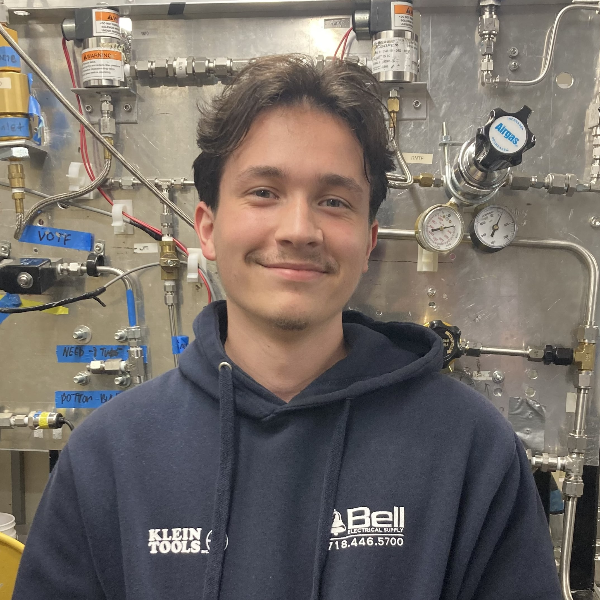

  
  <h1><strong>Kacper Bazan</strong></h1>

  

    <em><strong>Kacper.space</strong> is my personal website. Turning the world from all cap to all Kap™.</em>
  

---

## 👽 About my Website

`Kacper.space` ain't nothing fancy. Just a digitzed showcase of who I am, what I'm working on, and the ideas buzzing around in my cluttered head.

**Features include:**
- 🛠️ **Projects**: The stuff I'm proud of.
- 📄 **Resume**: The boring document your company wants.
- 🧠 **Brain Dump**: Stories, shpiels, and sagas.

Check me out at [Kacper.space](https://kacper.space).

---

## 🌟 Highlights

Here's some of the cool things I've worked on:

### Projects

**Project Name 1**: A quick description. [More info](link-to-project).

**Project Name 2**: Another brief description. [Check it out](link-to-project).

---

## 📬 Get in Touch

Send me a joke, comment, idea, critique, or a hello on the following platforms:

*  [Instagram (@kacperbazan_)](https://www.instagram.com/kacperbazan_)
*  [LinkedIn (@kacper-bazan)](https://www.linkedin.com/in/kacper-bazan/)
*  [LinkTree (@kacperb)](https://www.linkedin.com/in/kacper-bazan/)
*  [YouTube (@thatskap)](https://www.linkedin.com/in/kacper-bazan/)
*  [Comic Strips (@simpleshapescomics)](https://www.instagram.com/simpleshapescomics/)
